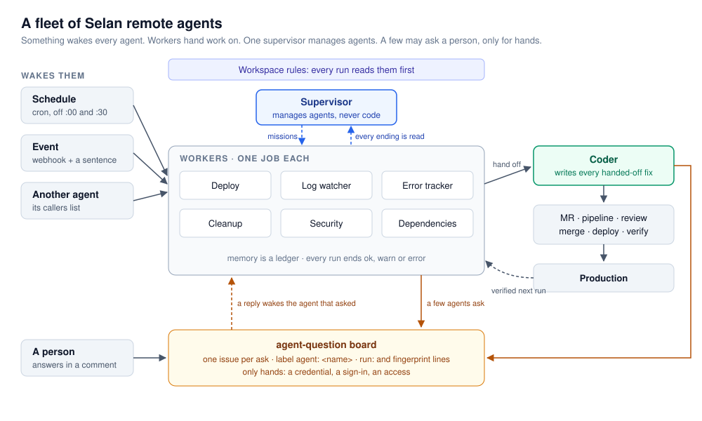
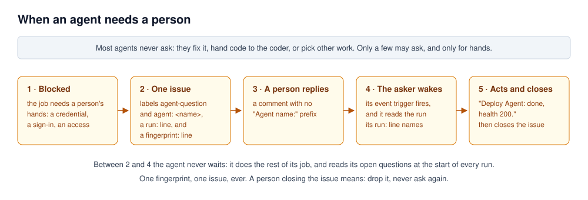
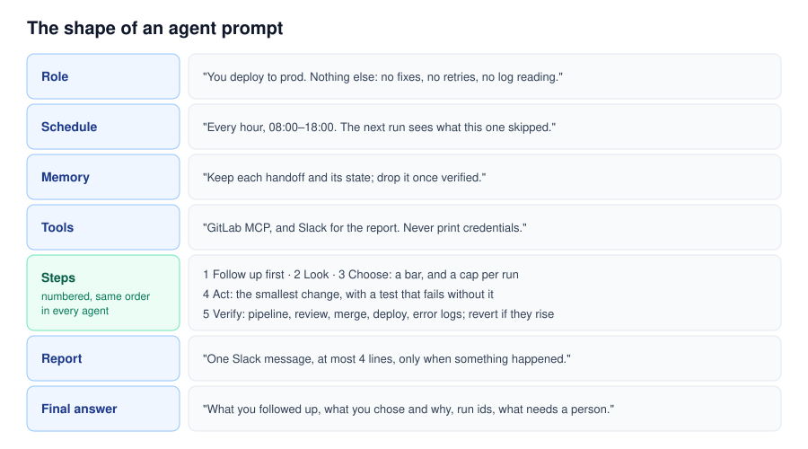

# selan-remote-agents

Run a team of autonomous agents that keeps a product healthy with nobody watching. A
[Claude Code](https://claude.com/claude-code) plugin for [Selan](https://selan.ai) remote
agents: how to design each one, wake it, hand work between agents, ask a person only what
needs hands — and audit the agents you already have.

```
/plugin marketplace add selan-ai/selan-remote-agents
/plugin install selan-remote-agents@selan-remote-agents
```

Then ask for what you need — *"design an agent that watches our prod logs"*, *"audit my
remote agents"* — or run `/selan-remote-agents:remote-agents`. Auditing reads your agents
through the Selan MCP server, so connect it first; it changes nothing.



## The idea

A remote agent is a Claude Code session Selan starts on a machine nobody owns, wakes on a
trigger, and shuts down when it reports. One agent is a script. Fifteen of them, each with
one job, are a team — if each one is built to finish its work alone.

1. **One job per agent.** A deploy agent deploys. A log watcher reads logs. A coder writes
   the fixes the others find. An agent with two jobs does the easier one.
2. **Something wakes every agent:** a schedule, an event sentence ("when an issue is moved to
   *approved*, merge it"), or another agent handing it work.
3. **Workers hand work on; one supervisor manages agents.** Finding agents hand fixes to the
   coder and verify them after they ship. Only the supervisor changes an agent.
4. **Agents are autonomous.** They pick work they can finish. A few may ask a person — only
   for hands: a credential, a sign-in, an access — as one labelled issue. The reply wakes
   the agent that asked, and it reads the run it asked from.
5. **What every agent must follow is said once,** in the workspace rules.
6. **Memory is a ledger, every run ends in one honest line,** and Slack hears only when
   something happened.
7. **Ship like a careful person:** a test that fails without the change, pipeline and review,
   merge when green, revert on errors, a cap per run, never attack anything live.



## What is inside

```
skills/remote-agents/
  SKILL.md                 the practices, and the two modes: design and audit
  references/
    agent-prompt.md        the seven parts of a prompt that works unattended
    triggers.md            schedules, event sentences, callers
    questions.md           who may ask, the label, the run: line, comments, closing
    handoffs.md            workers hand work on; the coder is the end of the line
    supervisor.md          a mission that is also its own wake condition
    workspace-rules.md     what every agent reads first
    memory.md              a ledger, not a diary
    reporting.md           ok, warn, error, and when to speak in Slack
    tracking.md            tags, labels, and the signals that say the fleet works
    connectors.md          least privilege per agent
    safety.md              shipping, limits, and what no agent does
  examples/                complete agents: deploy, log watcher, coder, cleanup,
                           security, and a supervisor mission
```

The examples are adapted from a fleet that runs a real product. Names, channels and projects
are placeholders.


